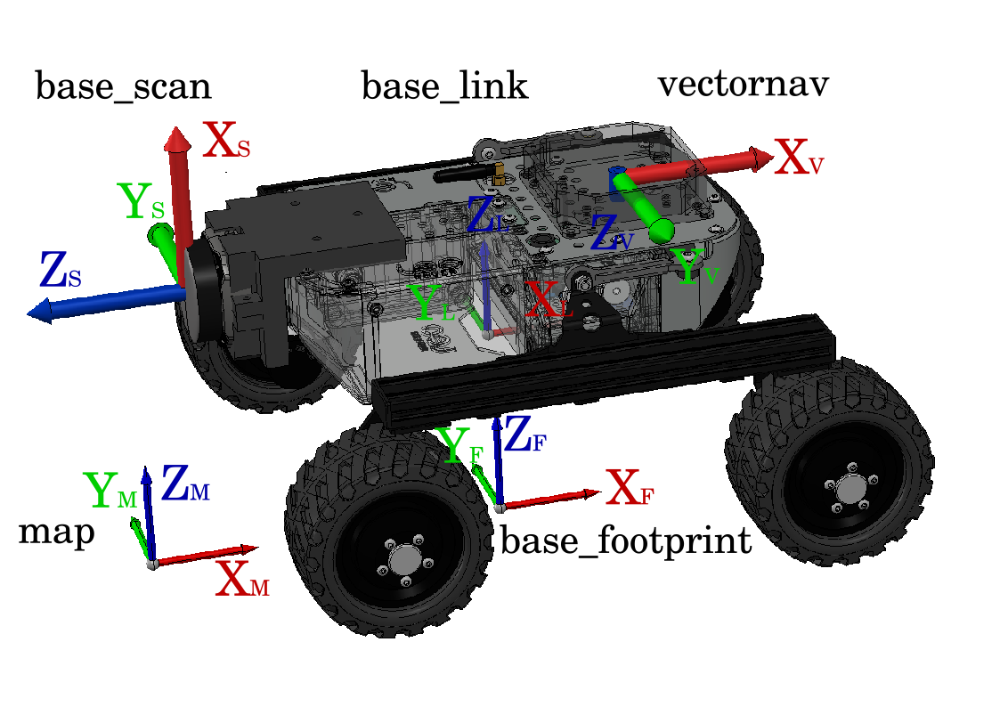

# Laser_RobMap

## Overview

`Laser_RobMap` is a ROS2 package designed for three-dimensional mapping using a two-dimensional LiDAR sensor mounted on a mobile robotic platform, as illustrated in the figure below. Although initially developed for the [Leo Rover](https://www.leorover.tech/) and using external IMU, the package is compatible with any ROS2-enabled robot that provides inertial data. It offers configurable parameters to optimize performance on low-cost, resource-limited hardware. Its primary goal is to provide a reliable 3D mapping solution, based on cost-effective mechanism, for future applications in autonomous navigation based on 3D SLAM (Simultaneous Localization and Mapping).



## Features

- **Angular laser filter**: Allows users to control the scan range of the 2D LiDAR sensor according to parameters described in the configuration section below.
- **Map resolution**: Users can adjust the resolution for the robot’s straight-line movement to suit their needs.
- **Output file formats**: Users can choose to export point cloud data in three different file formats.
- **Voxelization**: Enables voxelization to optimize map data for better efficiency and management.
- **Real-time visualization**: Users can opt to either save data only or visualize it in real time.

Additional parameters are detailed in the configuration table below.

## Installation
For running the provided examples, it is **essential** to have the following setup in place:

### Prerequisites for the Robot Computer

The following packages must be installed on the Raspberry Pi (Leo Rover) to run the necessary topics for our tool:

- **[LeoOS-ros2](https://github.com/LeoRover/LeoOS-ros2)**: An experimental version of LeoOS with ROS 2 support, based on Ubuntu 22.04 Jammy Jellyfish and bundled with the ROS 2 Humble distribution.
- **[vectornav](https://github.com/dawonn/vectornav/tree/ros2)**: A ROS 2 interface for the VectorNav VN-300 device, publishing the topic `sensor_msgs/Imu`.
- **[sllidar_ros2](https://github.com/Slamtec/sllidar_ros2)**: A ROS 2 interface for the RPLIDAR S3 device, publishing the topic `sensor_msgs/LaserScan`.

### Prerequisites for the Remote Computer

This package has been tested with ROS 2 Humble and ROS 2 Foxy. Ensure the following ROS 2 packages are installed:

- **[robot_localization](https://github.com/cra-ros-pkg/robot_localization)**: Used for sensor fusion and state estimation. Install it in the `src` folder of your workspace. A sample launch file, `ekf_leo.launch.py`, is provided in the `doc` folder of this repository.
- **[leo_desktop-ros2](https://github.com/LeoRover/leo_desktop-ros2)**: Required for visualizing the Leo Rover model in RViz, essential for real-time demonstrations using the `leo_viz` package.
- **[leo_common-ros2](https://github.com/LeoRover/leo_common-ros2)**: Provides the `leo_description` package, which is necessary for generating the robot model and managing transformations for the Leo Rover.


Additionally, `Laser_RobMap` for any other aplications requires the following Python modules to be installed:

- sensor_msgs
- sensor_msgs_py
- std_msgs
- tf2_ros
- numpy
- math
- open3d
- laspy

### Building from Source on Remote Computer

1. Create a ROS2 workspace (if you haven't already):

    ```bash
    mkdir -p ~/ros2_ws/src
    cd ~/ros2_ws
    ```

2. Clone the repository into the `src` directory:

    ```bash
    cd ~/ros2_ws/src
    git clone https://github.com/FredMSaico/laser_robmap.git
    ```

3. Install any dependencies using `rosdep`:

    ```bash
    cd ~/ros2_ws
    rosdep install --from-paths src --ignore-src -r -y
    ```

4. Build the workspace:

    ```bash
    colcon build --packages-select laser_robmap
    ```

5. Source the workspace:

    ```bash
    source ~/ros2_ws/install/setup.bash
    ```
## Nodes

### `laserscan_projector`

- **Description**: A node that projects each laser scan sweep into 3D points on a fixed frame map.
- **Subscribed Topics**:
  - `/scan` (`sensor_msgs/LaserScan`): Receives incoming laser scan data from the [RPLIDAR S3](https://github.com/Slamtec/sllidar_ros2) sensor.
  - `/tf` (`tf2_msgs/TFMessage`): Uses the `tf2_ros` node to obtain the transformation matrix.
- **Published Topics**:
  - `/cloud` (`sensor_msgs/PointCloud2`): Publishes the point cloud projected in a fixed frame map.

### `map_generator`

- **Description**: A node that accumulates points obtained from the previous node to generate a 3D map, which can be visualized in real-time or exported in various formats. The generated map can be used for route planning and/or autonomous navigation in the constructed environment.
- **Subscribed Topics**:
  - `/cloud` (`sensor_msgs/PointCloud2`): Receives the projected point cloud.
  - `/odometry` (`nav_msgs/Odometry`): Used to detect changes in attitude and position of the robot.
- **Published Topics**:
  - `/map` (`sensor_msgs/PointCloud2`): Publishes the generated map in a fixed frame map, checking for changes in odometry.

## Usage

### Running the Nodes

To run the nodes provided by the `Laser_RobMap` package, use the following commands:

1. Launch the [robot_localization](https://github.com/cra-ros-pkg/robot_localization) package to improve odometry and publish frame transformations:
   ```bash
    ros2 launch robot_localization ekf_leo.launch.py
    ```
2. Launch Laser_RobMap nodes:

    ```bash
    ros2 launch laser_robmap leo_map.launch.py
    ```
4. To visualize the mapping process, use RViz:

    ```bash
    ros2 launch leo_viz rviz.launch.xml
    ```
You can view the demonstration video at the following link: **[Video](https://drive.google.com/file/d/1N4ubwArkp9ySVB42jXYfYM3W8A43AMF8/view?usp=sharing)**

### Configuration

You can configure the behavior of `Laser_RobMap` by modifying the parameters acoording to table below. The default configuration file is located at:

- `config/params.yaml`

| Node                   | Params                      | Default value                                | Data type | Configuration Method    |
|------------------------|------------------------------|----------------------------------------------|-----------|--------------------------|
| lasercan_projector     | `angle_max`<br>`angle_min`<br>`angle_res`   | 180.00<br>-180.00<br>0.225                            | double    | `params.yaml`            |
| map_generator          | `step_line`<br>`step_rot`    | 0.05<br>0.01                                | double    | `params.yaml`            |
| tf2_ros                | `vectornav`<br> `base_scan`   | ['0.707', '0.707', '0', '0']<br>['0', '-0.7071', '0', '0.7071'] | double    | `leo_map.launch.py`      |
| map_generator          | `PCD`<br> `PLY`<br> `LAS`    | True<br> False<br> False                          | boolean   | `params.yaml`            |
| map_generator          | `voxel_size`                 | 0.05                                        | double   | `params.yaml`            |
| rviz2                  | `viz`                        | True                                       | boolean   | `params.yaml`            |
